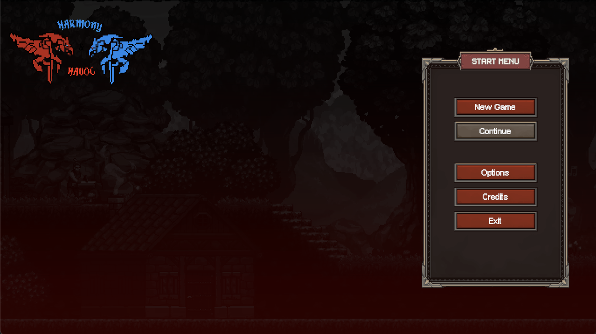
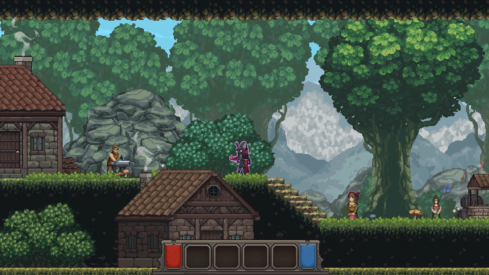
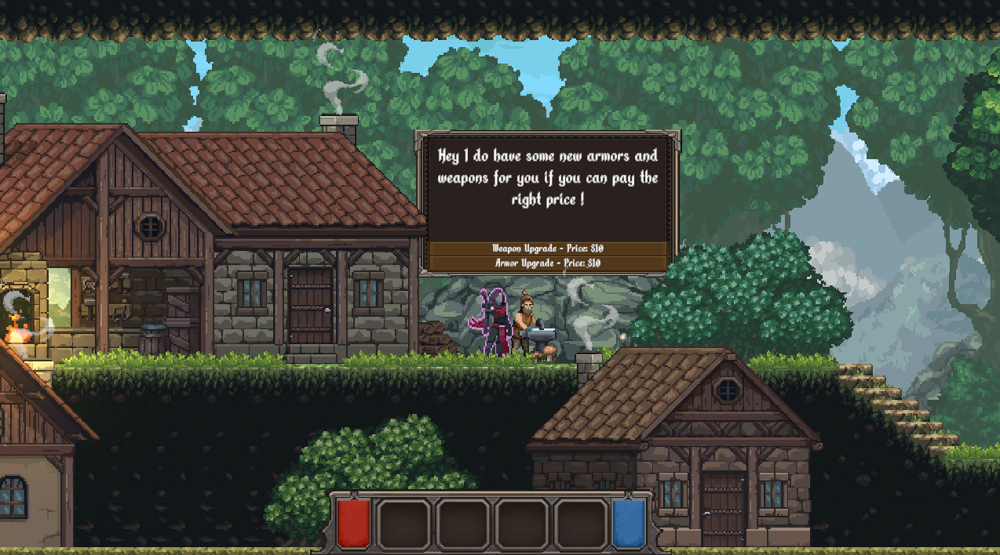
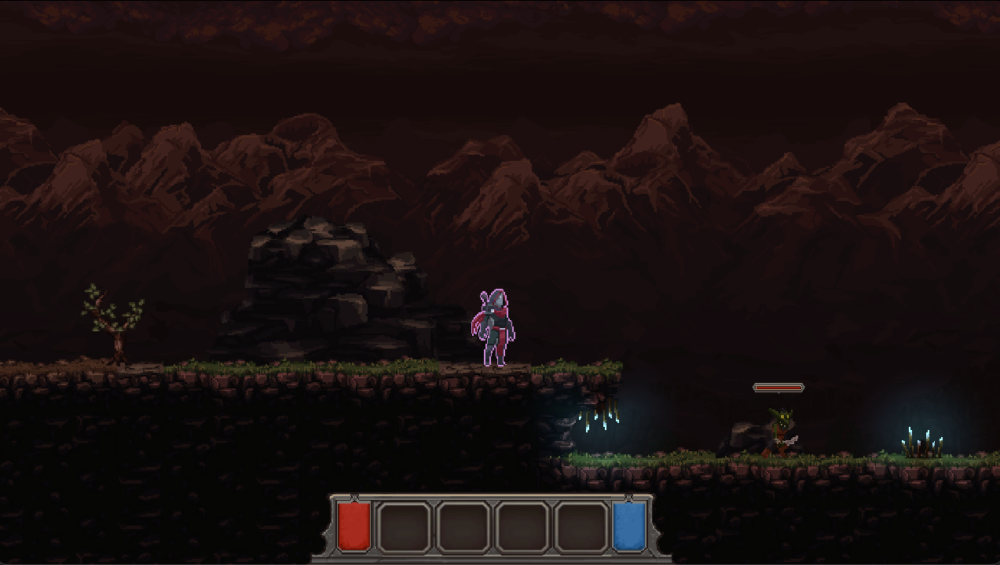

# Harmony and Havoc

Projet final réalisé dans le cadre d'un cours de développement de jeu avec Unity.

Harmony and Havoc est un jeu de plateforme 2D avec des éléments d'action et de progression. Le projet est conservé ici comme archive académique et comme élément de portfolio. Cette version du dépôt vise surtout à rendre le projet consultable, compilable et testable à partir d'une version de release.

## Contexte du projet

Ce projet a été développé en équipe dans un cadre scolaire. L'objectif était de concevoir un jeu complet autour d'une boucle jouable, avec menus, niveaux, contrôles, ennemis, systèmes de progression et fin de partie.

Le dépôt reflète l'état final du projet étudiant, avec quelques ajustements de présentation afin de faciliter l'ouverture du projet dans Unity et la création d'un build testable.

## Technologies utilisées

- Unity `2022.3.10f1`
- C#
- Universal Render Pipeline
- Input System de Unity
- TextMeshPro
- Cinemachine

## Fonctionnalités principales

- Menu principal et navigation d'interface
- Plusieurs scènes de jeu incluses dans le build
- Déplacements de personnage de plateforme 2D
- Système de combat et d'ennemis
- Système de progression et de connaissances
- Sauvegarde locale
- Séquences de fin selon l'état de la partie

## Captures d'écran

### Menu principal



### Village



### Interaction avec un personnage



### Niveau de jeu



## Installation du projet

1. Installer Unity `2022.3.10f1` avec Unity Hub.
2. Cloner le dépôt.
3. Ouvrir le dossier du projet dans Unity Hub.
4. Laisser Unity restaurer les dépendances définies dans `Packages/manifest.json`.
5. Ouvrir la scène `Assets/Scenes/BuildScenes/MainMenu.unity`.

## Scènes incluses dans le build

- `Assets/Scenes/BuildScenes/MainMenu.unity`
- `Assets/Scenes/BuildScenes/InGameUI.unity`
- `Assets/Scenes/BuildScenes/Village.unity`
- `Assets/Scenes/BuildScenes/Lvl1.unity`
- `Assets/Scenes/BuildScenes/Lvl2.unity`
- `Assets/Scenes/BuildScenes/Lvl3.unity`
- `Assets/Scenes/BuildScenes/Ending.unity`

## Générer un build

Le projet contient une commande d'éditeur Unity permettant de produire un build en mode batch.

### macOS

```bash
/Applications/Unity/Hub/Editor/2022.3.10f1/Unity.app/Contents/MacOS/Unity \
  -batchmode \
  -quit \
  -projectPath "$(pwd)" \
  -executeMethod BuildCommand.PerformBuild \
  -buildTarget StandaloneOSX \
  -buildOutput "Builds/macOS/Harmony and Havoc.app" \
  -logFile "Builds/build-macos.log"
```

### Windows

Le module Windows Build Support doit être installé dans Unity Hub avant de générer un build Windows.

```bash
/Applications/Unity/Hub/Editor/2022.3.10f1/Unity.app/Contents/MacOS/Unity \
  -batchmode \
  -quit \
  -projectPath "$(pwd)" \
  -executeMethod BuildCommand.PerformBuild \
  -buildTarget StandaloneWindows64 \
  -buildOutput "Builds/Windows/HarmonyAndHavoc.exe" \
  -logFile "Builds/build-windows.log"
```

## Notes

Ce projet est présenté comme un projet académique archivé. Certaines décisions techniques, certains fichiers et certaines structures reflètent les contraintes et le niveau d'expérience au moment de sa réalisation.

## Licence

Ce projet est publié sous licence Unlicense. Voir le fichier `LICENSE` pour plus de détails.
